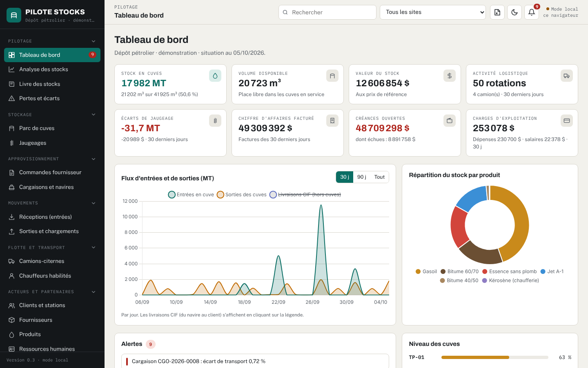
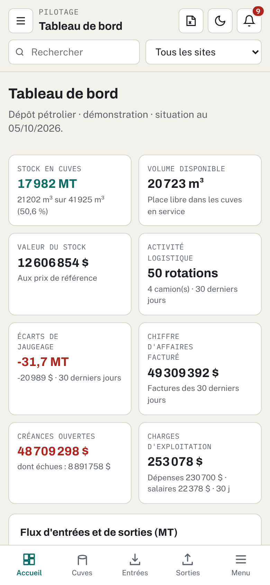

# Pilote Stocks

Prototype de logiciel de gestion d'un dépôt pétrolier : cuves, jaugeages, cargaisons, réceptions, sorties et chargements de camions, facturation, paiements, dépenses, ressources humaines, paie et maintenance.

L'application tient dans une seule page web. Elle fonctionne sur ordinateur, tablette et téléphone, et peut s'installer comme une application.





> **Données de démonstration.** Au premier lancement, l'application charge un jeu de données **entièrement fictif** (entreprises, personnes, navires et immatriculations inventés). Les dates sont recalées automatiquement sur le jour d'ouverture. Le bouton « Vider pour commencer » efface ces exemples.

---

## Ce que contient l'application

| Domaine | Modules |
|---|---|
| Pilotage | Tableau de bord (indicateurs, courbe des flux, répartition du stock, alertes, échéances), analyse des stocks (rotation, autonomie, freinte, valorisation, synthèse mensuelle), livre des stocks, pertes et écarts |
| Stockage | Parc de cuves (jauges visuelles, autonomie), jaugeages avec cause et explication des écarts |
| Approvisionnement | Commandes fournisseur, cargaisons et navires (surestaries, écart B/L / terre) |
| Mouvements | Réceptions, sorties (ITT, CIF, camions, fûts, transferts entre cuves, consommation interne) |
| Flotte et transport | Camions-citernes et chauffeurs habilités (certificats, permis, formation HSE) |
| Acteurs | Clients et stations-service, fournisseurs, produits, ressources humaines |
| Finances | Facturation (remise, TVA, unité de facturation), paiements, dépenses, gestion de la paie |
| Opérations | Maintenance, configuration du dépôt, sauvegarde et restauration |

Documents produits : bon de sortie (PDF A4), ticket de sortie ou de réception (PDF 80 mm pour imprimante à ticket), facture proforma, bulletin de paie, export Excel complet et synthèse mensuelle Excel.

Contrôles bloquants : stock insuffisant, débordement d'une cuve, camion non autorisé, chauffeur non habilité, transfert entre produits différents, fiche de paie en double.

---

## Mettre l'application en ligne gratuitement (GitHub Pages)

Aucune ligne de commande n'est nécessaire : tout se fait depuis le navigateur.

1. Créez un compte sur [github.com](https://github.com) (gratuit) et connectez-vous.
2. En haut à droite, **+** puis **New repository**.
   - *Repository name* : `pilote-stocks`
   - Visibilité : **Public** (obligatoire pour GitHub Pages avec un compte gratuit)
   - Cliquez sur **Create repository**.
3. Sur la page du dépôt vide, cliquez sur le lien **uploading an existing file**.
4. Ouvrez le dossier `pilote-stocks` sur votre ordinateur, sélectionnez **tout son contenu** (fichiers et dossiers `assets` et `docs`, pas le dossier lui-même) et glissez-le dans la page. Attendez la fin du chargement puis cliquez sur **Commit changes**.
5. Allez dans **Settings** puis **Pages** (menu de gauche).
   - *Source* : **Deploy from a branch**
   - *Branch* : **main** et **/ (root)**, puis **Save**.
6. Patientez une à deux minutes puis rechargez la page **Pages** : l'adresse du site s'affiche, de la forme

   ```
   https://VOTRE-NOM-GITHUB.github.io/pilote-stocks/
   ```

7. Ouvrez cette adresse sur votre téléphone. Pour l'installer comme une application :
   - **Android (Chrome)** : menu ⋮ puis **Ajouter à l'écran d'accueil** (ou **Installer l'application**).
   - **iPhone (Safari)** : bouton Partager puis **Sur l'écran d'accueil**.

Pour publier une nouvelle version : dans le dépôt, **Add file** puis **Upload files**, déposez les fichiers modifiés et validez. Le site se met à jour en une à deux minutes.

### Ce qu'il faut savoir sur cette version en ligne

- Sur GitHub Pages, l'application fonctionne en **mode local** : les données saisies sont enregistrées **dans le navigateur de chaque appareil**. Rien n'est envoyé à GitHub. Votre téléphone et votre ordinateur ont donc chacun leurs propres données.
- Le **code** du dépôt public est visible par tous (il ne contient que les données fictives). N'y déposez jamais de fichier de données réelles.
- Pensez à **télécharger une sauvegarde** (menu Configuration et sauvegarde) avant d'effacer les données du navigateur.

Autre hébergement de pages possible : [Netlify Drop](https://app.netlify.com/drop), en glissant le dossier `pilote-stocks` dans la page (créez un compte pour conserver le site).

---

## Travailler à plusieurs sur les mêmes données (mode serveur)

Le fichier `server.js` partage une seule base entre tous les appareils, avec mise à jour en temps réel. Il n'a besoin que de [Node.js](https://nodejs.org) (version LTS), sans autre installation.

**Sur un PC Windows**

1. Installez Node.js (version LTS, options par défaut).
2. Copiez le dossier `pilote-stocks` sur le PC qui servira de serveur (évitez un dossier synchronisé OneDrive).
3. Double-cliquez sur `DEMARRER-Windows.bat`. Une fenêtre affiche les adresses d'accès. **Ne la fermez pas** : c'est elle qui fait tourner le serveur.
4. Si Windows le demande, autorisez Node.js sur les **réseaux privés**.
5. Sur un téléphone connecté **au même réseau Wi-Fi**, ouvrez l'adresse affichée, du type `http://192.168.1.25:3000`.

**Sur Linux ou macOS** : `./demarrer-linux-mac.sh`

**Options**

| Variable | Rôle | Exemple |
|---|---|---|
| `CODE_ACCES` | Demande un code à l'ouverture (identifiant au choix) | `set CODE_ACCES=mon-code` avant `node server.js` |
| `PORT` | Port d'écoute (3000 par défaut) | `set PORT=8080` |

Les données sont enregistrées dans `data/base.json`, avec une copie automatique par jour dans `data/sauvegardes/` (30 jours conservés). Le dossier `data/` est exclu de Git et n'est jamais servi par le serveur.

**Sur un serveur en ligne** (accessible de partout) : utilisez le `Dockerfile` chez un hébergeur qui accepte Docker ou Node.js **avec un disque persistant** pour le dossier `data/`, définissez toujours `CODE_ACCES` et placez le site derrière HTTPS.

```bash
docker build -t pilote-stocks .
docker run -d -p 3000:3000 -v pilote-donnees:/app/data -e CODE_ACCES=votre-code --restart unless-stopped pilote-stocks
```

> Avant d'y mettre les données réelles d'une entreprise, obtenez son accord : héberger ses stocks, ses clients ou ses salaires chez un tiers est une décision qui lui revient.

---

## Fichiers

```
pilote-stocks/
├── index.html              l'application complète
├── manifest.webmanifest    installation sur téléphone
├── sw.js                   ouverture sans réseau après une première visite
├── server.js               serveur facultatif (mode partagé), sans dépendance
├── assets/
│   ├── exemple-donnees.js  données de démonstration fictives
│   ├── fonts/              polices
│   ├── vendor/             Chart.js (graphiques), SheetJS (Excel), jsPDF (PDF)
│   └── icon-*.png, icon.svg
├── docs/                   captures d'écran du README
├── DEMARRER-Windows.bat    lancement du serveur sous Windows
├── demarrer-linux-mac.sh   lancement du serveur sous Linux ou macOS
└── Dockerfile
```

## Limites du prototype

- Pas de comptes individuels ni de droits par service (un seul code d'accès commun en mode serveur).
- Pas de journal des modifications (qui a changé quoi et quand).
- Le volume à 15 °C est saisi par l'utilisateur : pas de calcul par les tables ASTM. La hauteur jaugée n'est convertie en volume que par une estimation linéaire, en attendant les barèmes réels des cuves.
- Tolérance d'écart, validité HSE, taux de retenues et seuil d'alerte de rupture sont des hypothèses réglables dans **Configuration et sauvegarde**.
- Les factures et bulletins PDF sont des documents de travail, sans valeur contractuelle ni légale.

Bibliothèques incluses : [Chart.js](https://www.chartjs.org) (MIT), [SheetJS Community Edition](https://sheetjs.com) (Apache 2.0), [jsPDF](https://github.com/parallax/jsPDF) (MIT). Polices Archivo, Public Sans et IBM Plex Mono (SIL Open Font License).
